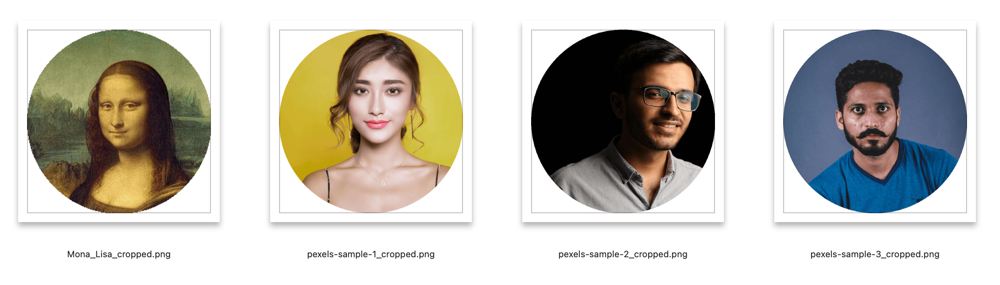

# FaceCrop

A Python command-line tool for automatically detecting and cropping portrait photos with transparent backgrounds.

Before: Original image with full background and surrounding context


After: Automatically cropped image focused on the face and upper body, with transparent background



## Features

- Automatic face detection and portrait cropping
- Clean, transparent background
- Optional circular mask for profile-style photos
- Batch processing for multiple images
- Supports common image formats (JPG, PNG, WEBP)
- Preserves original image quality

For technical details about the implementation, please see [TECHNICAL.md](TECHNICAL.md).

## Installation

```bash
# Clone the repository
git clone https://github.com/yourusername/FaceCrop.git
cd FaceCrop

# Install dependencies
pip install -r requirements.txt
```

## Usage

Process a single image:
```bash
python face_crop.py image.jpg
```

Process a directory of images:
```bash
python face_crop.py input_directory --output output_directory
```

Add circular mask:
```bash
python face_crop.py image.jpg --circular
```

Use strict mode (only MediaPipe detection):
```bash
python face_crop.py image.jpg --strict
```

You can combine options:
```bash
python face_crop.py input_directory --output output_directory --circular --strict
```

### Detection Modes

The tool supports two detection modes:

1. **Normal Mode** (default):
   - Uses multiple detection methods for maximum coverage
   - May occasionally detect non-human faces
   - Best for processing images where you want to catch all possible faces

2. **Strict Mode** (`--strict`):
   - Uses only MediaPipe's face detection
   - More accurate for human faces
   - Prevents false positives (e.g., won't detect cat faces)
   - Recommended when processing photos where accuracy is crucial

### Arguments

- `input`: Input image file or directory
- `--output`: Output directory (required for directory input)
- `--circular`: Add circular mask (optional)
- `--strict`: Use strict mode (optional)

## Output

- Format: PNG with transparency
- Name: `[original_name]_cropped.png`
- Aspect ratio: Square (1:1)

---

# FaceCrop 人像裁切工具

自動檢測並裁切人像照片的 Python 命令列工具，支援透明背景輸出。

## 功能特點

- 自動檢測人臉並裁切人像
- 乾淨的透明背景
- 可選擇性添加圓形遮罩製作個人頭像
- 支援批次處理多張圖片
- 支援常見圖片格式（JPG、PNG、WEBP）
- 保持原始圖片品質

技術實作細節請參考 [TECHNICAL.md](TECHNICAL.md)。

## 安裝方式

```bash
# 複製專案
git clone https://github.com/yourusername/FaceCrop.git
cd FaceCrop

# 安裝相依套件
pip install -r requirements.txt
```

## 使用方法

處理單張圖片：
```bash
python face_crop.py 圖片.jpg
```

處理整個資料夾：
```bash
python face_crop.py 輸入資料夾 --output 輸出資料夾
```

添加圓形遮罩：
```bash
python face_crop.py 圖片.jpg --circular
```

使用嚴格模式（僅使用 MediaPipe 偵測）：
```bash
python face_crop.py 圖片.jpg --strict
```

您可以結合選項：
```bash
python face_crop.py 輸入資料夾 --output 輸出資料夾 --circular --strict
```

### 偵測模式

工具支援兩種偵測模式：

1. **正常模式**（預設）：
   - 使用多種偵測方法以達到最大覆蓋範圍
   - 可能偶爾偵測到非人臉
   - 適合處理圖片時想要捕捉所有可能的人臉

2. **嚴格模式** (`--strict`):
   - 僅使用 MediaPipe 的人臉偵測
   - 對人臉更準確
   - 防止偵測到非人臉（例如，不會偵測到貓臉）
   - 建議在處理照片時需要準確度時使用

### 參數說明

- `input`：輸入圖片或資料夾
- `--output`：輸出資料夾（處理資料夾時必須指定）
- `--circular`：添加圓形遮罩（選用）
- `--strict`：使用嚴格模式（選用）

## 輸出結果

- 格式：具透明度的 PNG
- 檔名：`[原始檔名]_cropped.png`
- 比例：正方形 (1:1)