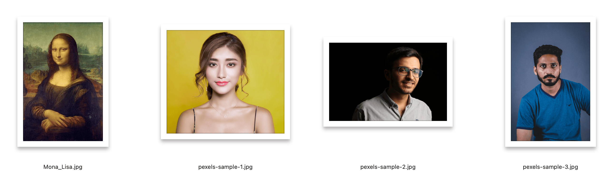

# A Tale of Event Magic 
### How FaceCrop Transformed Event Management

---

# Meet Peichi 

### An Operation Specialist's Daily Challenge:

- Managing 10+ events per month
- 50s of speaker portraits to process
- JPG, PNG, WEBP files flooding her inbox
- Different sizes, backgrounds, formats
- Hours spent on manual photo editing

---

# A Day in Peichi's Life (Before) 

### For Each Speaker Photo:
1. Download from email
2. Open in photo editor
3. Crop manually
4. Convert format
5. Resize for website
6. Save and organize

*Multiply this by 10 speakers per event...*

---

# The Breaking Point 

### One Late Night at the Office:

- Event website launch tomorrow
- 50 speaker photos still need processing
- Clock showing 11 PM
- Coffee getting cold
- Then she discovered **FaceCrop**

---

# The Magic Moment 

### Before FaceCrop:

- 15 minutes per photo
- Manual everything
- Inconsistent results
- Late nights at office

### After FaceCrop:

- 3 seconds per photo
- Drag, drop, done!
- Perfect consistency
- Home for dinner 

---

# How FaceCrop Changed Everything 

### Peichi's New Workflow:
1. Drag & drop all photos
2. Click process
3. Done!

*"It's like having a professional photo editor who works at the speed of light!"*
- Peichi, Operations Specialist

---

# Why We Need You 

### Help Us Help More Peichis:
- Event managers worldwide face this challenge
- Every minute saved = more impact created
- Your code can transform someone's workday
- Open source makes it accessible to all

---

# Join Our Community 

### Be Part of the Solution:
- Every line of code helps an event manager
- Your skills can make a difference
- Learn while helping others
- Build something people love

---

# Start Your Journey 

### Get Started Now:
- GitHub: [github.com/hlb/FaceCrop](https://github.com/hlb/FaceCrop)
- Join our community!

**Let's make event management a little more magical** 
